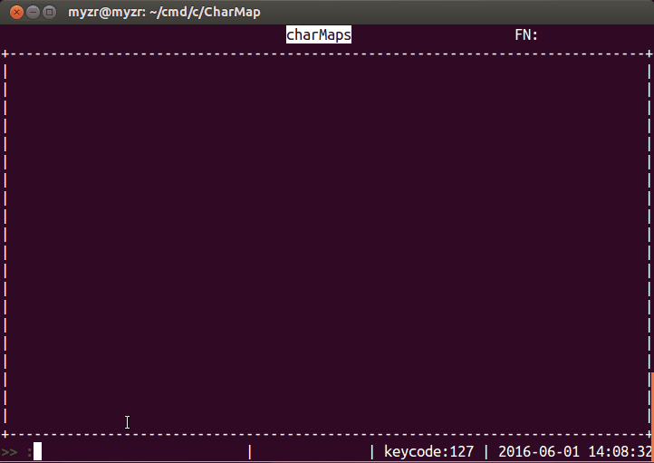

# CharMap

用VT100码在终端下做动画效果，从中可以推测出ncurses的大致工作机制，其中包括对字符串的各种处理。

## 思路来源

以前每次看到Terminal下一些具有动态效果的程序，总是接的好奇，不知道为什么，后来无意从知道VT100码，才开始知道这些东西的本质是什么，于是想自己采用VT100码来封装成一个库，同时写一个Demo，一定要具有动态效果，于是这个CharMap就出现了。

## 程序运行效果

* 初始软件界面:  


* 执行snw命令界面:  


* 执行rdw命令界面:  


## 程序如何运行
* make编译出程序
* 程序采用了[ParseConf](https://github.com/AplexOS/ParseConf)，需要配置文件，名称是properties.ppts，内容如下：

```
    title = charMaps
    rows = 24 
    cols = 80
    interval = 10000
    version = 1.0
```

* 运行程序，目前程序仅支持2个命令：
  1. snw；
  2. rdw。

## Author:

[曾剑锋](http://www.cnblogs.com/zengjfgit/)